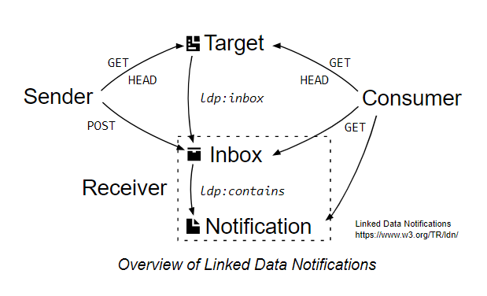

# Inbox

This project is an [Linked Data Notification](https://www.w3.org/TR/ldn/) implementation:



It is split to _consumer_ (+ sender), _receiver_ and a sample _target_ modules.
All are [node.js](https://nodejs.org/) ([express](https://expressjs.com/)) apps.

## Requirements
You need to install [node.js](https://nodejs.org/) (with included [npm](https://www.npmjs.com/get-npm)).
<!--Also, you will need [Python](https://www.python.org/downloads/) of version **2.7.xx**.
because of https://github.com/digitalbazaar/rdf-canonize/issues/5--> 

## Install
Run the following command in the **module's root folder**:
```bat
npm install
```
It installs all project dependencies, for details see https://docs.npmjs.com/cli/install.

## Run
_consumer_ listens on local port 8000, _receiver_ on 3000. You can change that in their bin/www files.
Run each module separately using following command in the **module's root folder**:
```bat
npm start
```
The _consumer_ requires the _receiver_ to be running.

## Usage
You can try the _consumer_ in your browser at http://localhost:8000/.
When you post
```json
{"@context": "https://www.w3.org/ns/activitystreams",
 "type": "Note",
 "to": ["https://chatty.example/ben/"],
 "attributedTo": "https://social.example/alyssa/",
 "content": "Say, did you finish reading that book I lent you?"}
```
with `Content-Type: application/ld+json` to http://localhost:5001/API/notifications, the _receiver_ will return 201 with
location. You can then GET it at http://localhost:5001/API/notifications/xx. Or let the _consumer_ display it in the browser
at http://localhost:8000/notification/xx.
